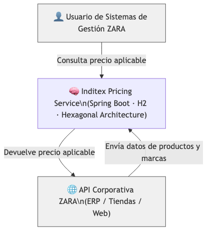
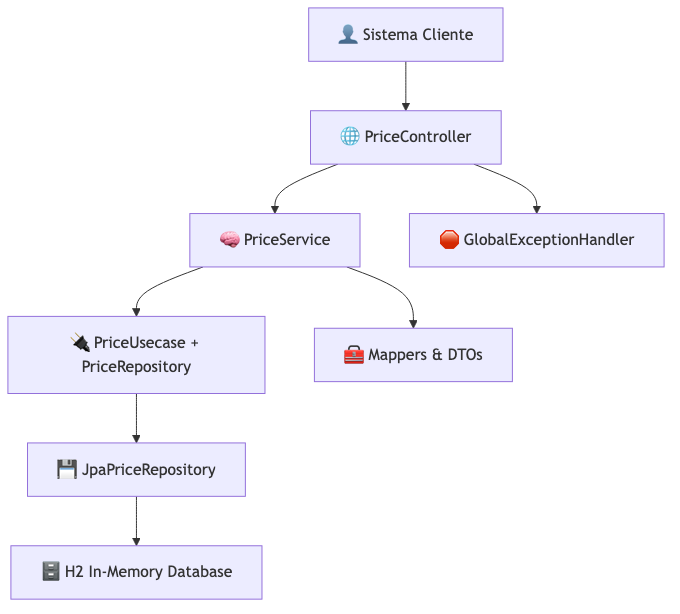
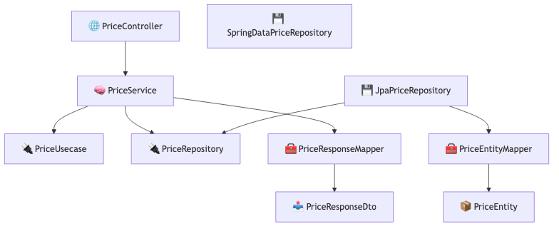
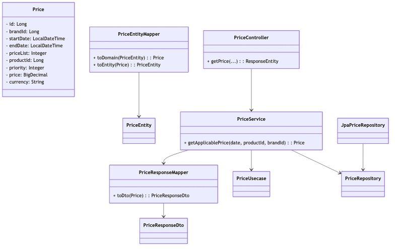
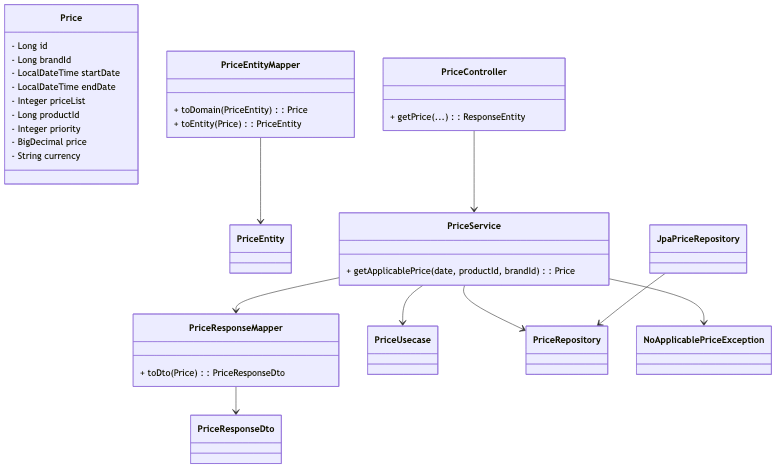
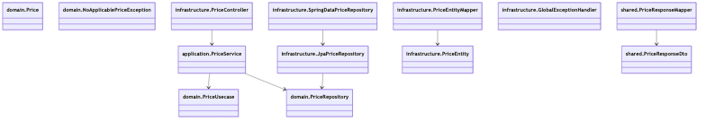
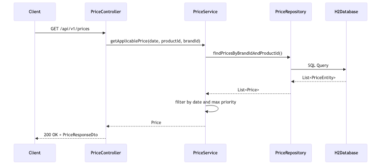
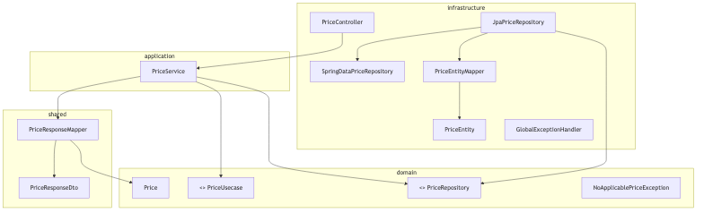

# 📐 Arquitectura del Sistema – Inditex Pricing Service

Este documento describe la arquitectura implementada para la prueba técnica de BCNC / ZARA. La solución está basada en **arquitectura hexagonal**, principios **DDD** y **SOLID**, con una API REST construida en Spring Boot y persistencia embebida H2.

---

## 🧱 Modelo C4

A continuación, se presenta una descripción progresiva de la arquitectura del sistema usando el modelo C4.

### 1️⃣ Diagrama de Contexto

El sistema se integra con APIs corporativas de ZARA y es consumido por usuarios de los sistemas internos de gestión.

📄 [`c4-level1-context.mmd`](./diagrams/c4/c4-level1-context.mmd)  
🖼️ 

---

### 2️⃣ Diagrama de Contenedores

Representa la arquitectura lógica del sistema: controlador REST, capa de aplicación (casos de uso), puertos, adaptadores JPA, mapeadores y base de datos embebida.

📄 [`c4-level2-container.mmd`](./diagrams/c4/c4-level2-container.mmd)  
🖼️ 

---

### 3️⃣ Diagrama de Componentes

Expone cómo los componentes colaboran dentro de cada capa. Incluye controladores, servicios, interfaces de dominio (puertos), adaptadores y mapeadores.

📄 [`c4-level3-component.mmd`](./diagrams/c4/c4-level3-component.mmd)  
🖼️ 

---

### 4️⃣ Diagrama de Clases

Detalla las clases esenciales como `Price`, `PriceService`, `PriceRepository`, DTOs y mappers.

📄 [`c4-level4-class-diagram.mmd`](./diagrams/c4/c4-level4-class-diagram.mmd)  
🖼️ 

---

## 🧬 Diagramas UML

Los diagramas UML complementan el modelo C4, proporcionando una visión técnica detallada.

### 🏗️ Diagrama de Clases

Muestra las relaciones entre las entidades del dominio, servicio de aplicación, DTOs y mappers.

📄 [`class-diagram.mmd`](./diagrams/uml/class-diagram.mmd)  
🖼️ 

---

### 📦 Diagrama de Paquetes

Representa la organización por capas hexagonales: dominio, aplicación, infraestructura y recursos compartidos.

📄 [`package-diagram.mmd`](./diagrams/uml/package-diagram.mmd)  
🖼️ 

---

### 🔁 Diagrama de Secuencia

Explica el flujo completo de una consulta de precios a través de la API REST.

📄 [`sequence-diagram.mmd`](./diagrams/uml/sequence-diagram.mmd)  
🖼️ 

---

### 🧭 Diagrama Visual de Arquitectura Hexagonal

Representación visual de cómo se conectan los puertos, adaptadores, servicios y DTOs en la arquitectura hexagonal.

📄 [`hexagonal-architecture.mmd`](./diagrams/uml/hexagonal-architecture.mmd)  
🖼️ 

---

## 🧩 Estándares y Principios Aplicados

- ✅ **Arquitectura Hexagonal (Ports & Adapters)**
- ✅ **Separación por capas**: Domain, Application, Infrastructure, Shared
- ✅ **Dominio rico modelado con DDD**
- ✅ **Principios SOLID** aplicados en todos los niveles
- ✅ **Clean Code y responsabilidad única**
- ✅ **Cobertura Jacoco > 90%**
- ✅ **CI/CD integrado con GitHub Actions y SonarCloud**
- ✅ **Documentación visual completa (C4 + UML)**

---

## 📁 Estructura del Proyecto

```bash
src/
├── domain/
│   ├── model/                     # Clase de dominio: Price
│   ├── exception/                 # Excepción de negocio: NoApplicablePriceException
│   └── port/
│       ├── input/                 # Puerto de entrada: PriceUsecase
│       └── output/                # Puerto de salida: PriceRepository
├── application/
│   └── PriceService               # Implementación del caso de uso
├── infrastructure/
│   ├── controller/                # PriceController (REST)
│   ├── exception/                 # GlobalExceptionHandler
│   └── persistence/
│       ├── entity/                # PriceEntity (JPA)
│       ├── mapper/                # PriceEntityMapper
│       └── repository/            # JpaPriceRepository, SpringDataPriceRepository
├── shared/
│   ├── dto/                       # PriceResponseDto
│   └── mapper/                    # PriceResponseMapper
